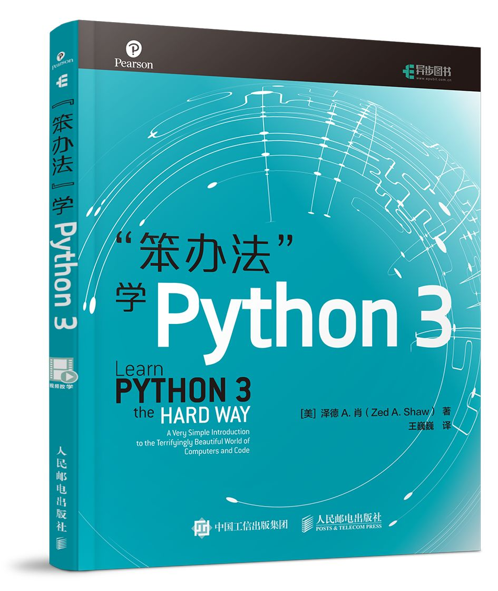

# 《“笨办法”学Python 3》的读书笔记和编程习题

借此 repository 记录一下我看《“笨办法”学Python 3》时所做的一些笔记和编程习题。

## 读书进度

- [x] [习题 0 准备工作](ex0/README.md)
- [x] [习题 1 第一个程序](ex1/README.md)
- [x] [习题 2 注释和#号](ex2/README.md)
- [x] [习题 3 数字和数学计算](ex3/README.md)
- [x] [习题 4 变量和命名](ex4/README.md)
- [x] [习题 5 更多的变量和打印](ex5/README.md)
- [x] 
- [x] 
- [x] 
- [x] 
