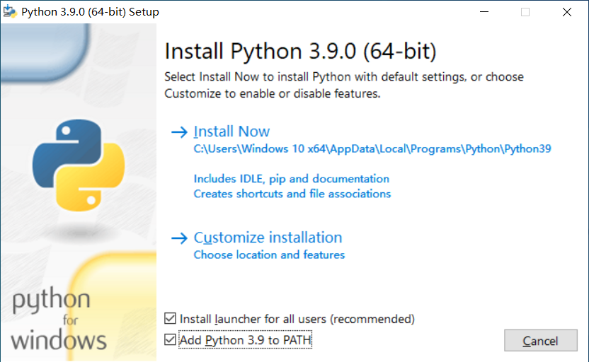

# 习题 0 准备工作

## 下载 Python

Python 的官方下载页面会自动识别当前操作系统。从页面上方的 **Download the latest version for Windows** 或者 **Download the latest version for** 直接下载 Python 的最新版本即可。

> <https://www.python.org/downloads>

## 安装 Python

Windows 安装的时候，注意勾选 **Add Python 3.x to PATH**

## 关于开发环境

本书作者选择了 Atom 作为代码编辑器，Atom 是 GitHub 自家的跨平台文本编辑器。但时至今日，微软才是 GitHub 的爸爸，而微软的 Visual Studio Code (简称 VSCode / VSC) 才是当今最流行的“免费/开源/跨平台”代码编辑器。

> <https://code.visualstudio.com>
